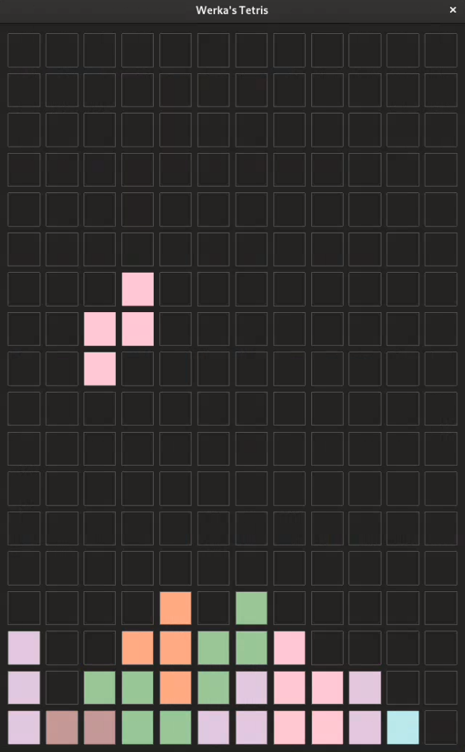

# CLetris

A classic block-stacking game in Common Lisp.
<p align="left">
  
</p>


## How to run it
You'll need an instance of Common Lisp on your computer.

**1. From the REPL**

``` lisp
> (ql:quickload :cl-tetris)
> (cl-tetris:run)
```
**2. Make executable (SBCL only)**

Run ```./sbcl-make-executable.run``` script,
then the ```./cl-tetris``` binary.

## Controls
* left/right - move blocks
* down - drop faster
* up - rotate
* space - pause/unpause
* esc - quit


## REPL logs
- current score, level and speed
- reaching the next level (and therefore increasing the speed of the blocks)
- pausing or failing the game
  
<br/><br/>


*(Done while exploring Common Lisp. (Expect parentheses.))*
